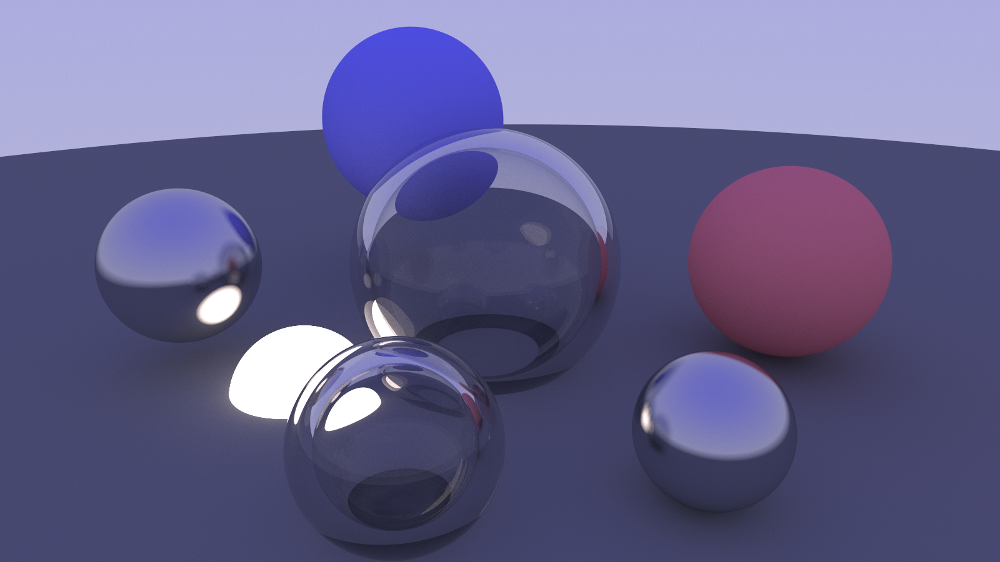
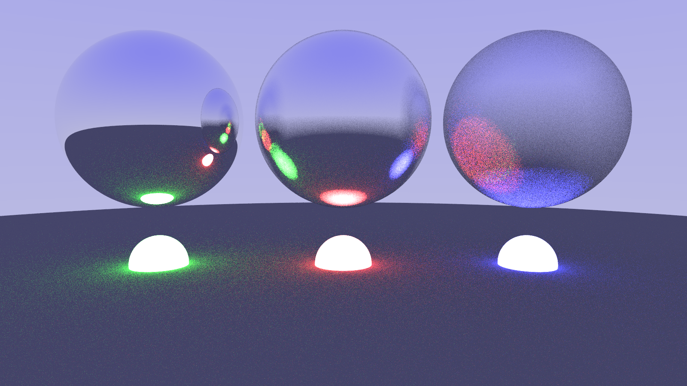
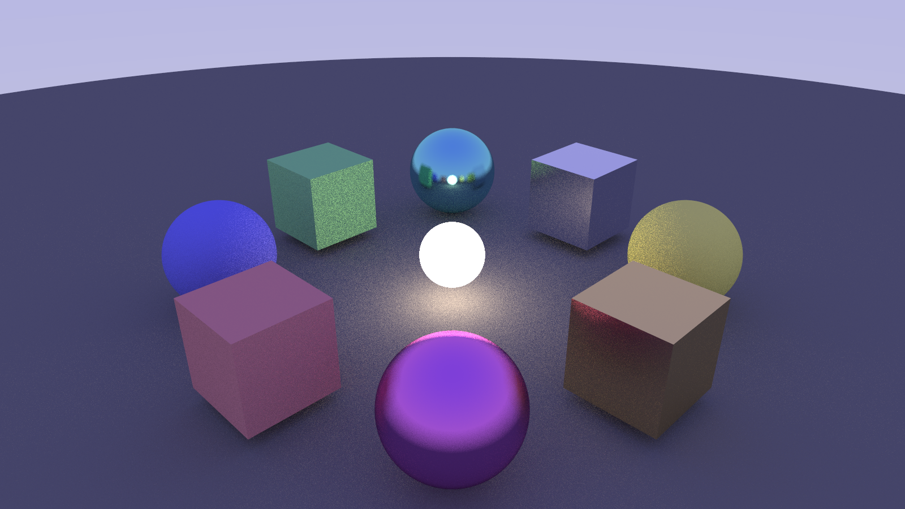
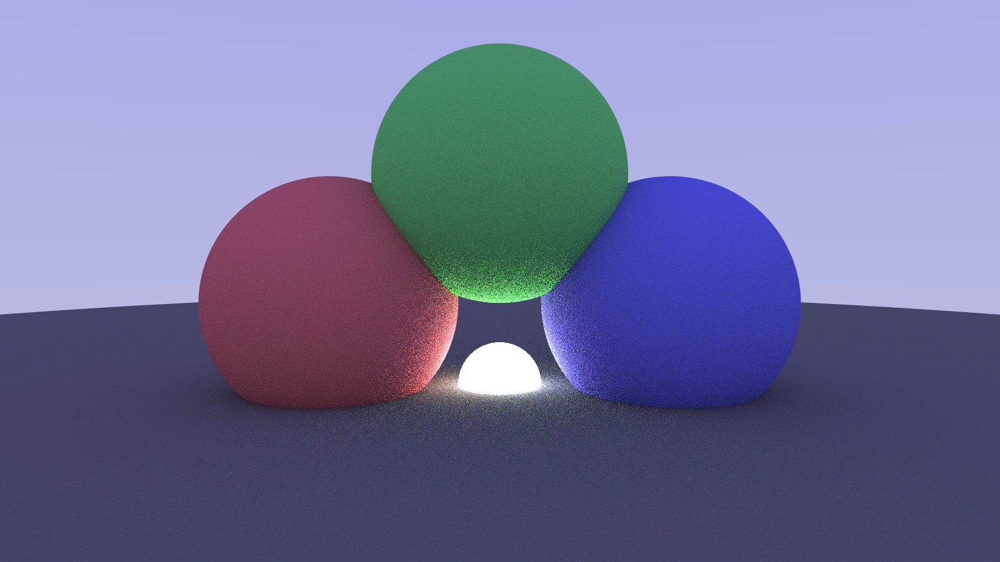

# TinyTracer

<a href="https://winter-of-open-source.vercel.app/"></a>

[](https://www.python.org/)
<a href="https://github.com/psf/black"></a>

**TinyTracer** is a Python path tracer that simulates light paths to generate realistic images.  

This project is part of **[Winter of Open Source](https://winter-of-open-source.vercel.app/)**, where contributors can improve the engine, add materials, implement new shapes, optimize performance etc.

## Demo Images






> Some demos may look noisy due to low sampling for faster renders.

## Features

Implemented so far:
- Sphere and Quadrilateral geometry
- Four material types: Lambertian, Metal, Dielectric, Emissive
- Multiprocessing for faster rendering
- Basic caching optimizations

## Table of Contents

- [Installation](#installation)
- [How to Contribute](#how-to-contribute)
- [Code of Conduct](#code-of-conduct)
- [References](#references)

## Installation

```bash
git clone https://github.com/datavorous/tinytracer.git
cd tinytracer

python3 -m venv .venv
source .venv/bin/activate # Linux/macOS
# .venv\Scripts\activate # Windows

pip install -e .
pip install uv pytest

uv run tinytracer/main.py

uv run pytest
```

> The generated image will be in `.ppm` format, inside the `output` folder.

## How to Contribute

This project has issues prepared for contributors at all levels: [Open Issues](https://github.com/datavorous/tinytracer/issues)

> Each issue is labeled by difficulty (`good-first-issue`, `easy`, `medium`, `hard`) and has clear instructions.

Please follow [CONTRIBUTING.md](CONTRIBUTING.md) for step-by-step guidance on:

* Setting up your environment
* Choosing and assigning issues
* Branching, committing, and creating PRs
* Code style and formatting rules (using `black`)
* PR acceptance criteria and points system

> [!WARNING]  
> Work on only one issue at a time.

## Code of Conduct

Please follow [CODE_OF_CONDUCT.md](CODE_OF_CONDUCT.md) to ensure a welcoming and productive environment for all contributors.

## References

* [Ray Tracing in One Weekend](https://raytracing.github.io/) (Part 1 and Part 2)
* [Understanding the Viewport](https://www.reddit.com/r/GraphicsProgramming/comments/1ej5ffo/raytracing_in_one_weekend_not_understanding_the/)
* See [explained.md](media/explained.md) for additional explanations.
